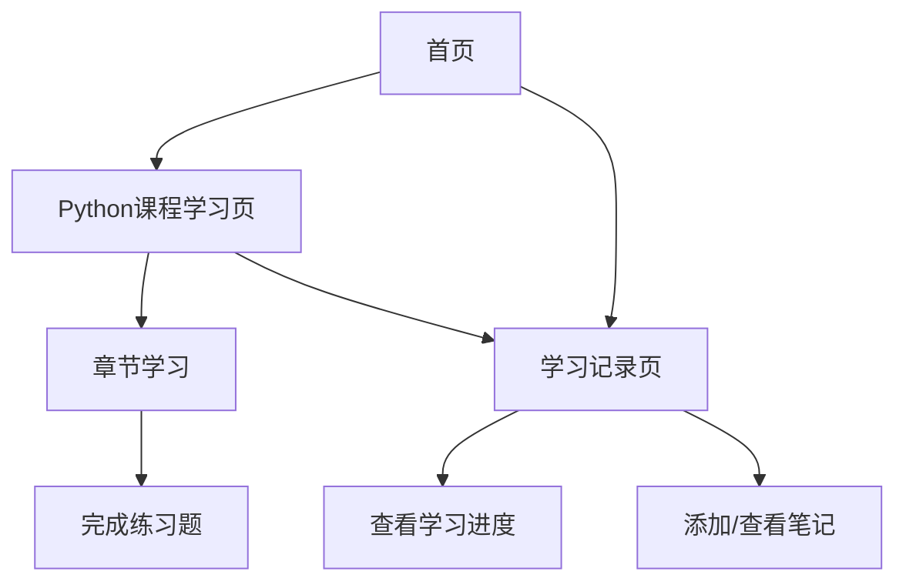

## 1. Product Overview
个人主页网站，包含Python基础课程学习模块，记录学习点滴和技术分享。
- 主要目的是提供Python学习资源和个人学习记录，方便用户系统学习Python基础知识。
- 目标用户为Python初学者和希望复习Python基础的开发者。

## 2. Core Features

### 2.1 User Roles
| Role | Registration Method | Core Permissions |
|------|---------------------|------------------|
| Visitor | 无需注册 | 浏览所有内容，访问Python课程学习模块 |
| Registered User | 邮箱注册 | 浏览所有内容，访问Python课程学习模块，保存学习进度 |

### 2.2 Feature Module
1. **首页**：导航栏，英雄区，Python课程入口，个人简介，最新学习记录
2. **Python课程学习页**：课程目录，章节内容，代码示例，练习题
3. **学习记录页**：学习进度，已完成章节，笔记

### 2.3 Page Details
| Page Name | Module Name | Feature description |
|-----------|-------------|---------------------|
| 首页 | 导航栏 | 包含网站标题，导航链接（首页，Python课程，学习记录） |
| 首页 | 英雄区 | 展示网站主题，包含Python课程学习模块的快速入口 |
| 首页 | Python课程入口 | 突出显示Python课程模块，提供直接进入课程的链接 |
| 首页 | 个人简介 | 简要介绍网站作者和网站目的 |
| 首页 | 最新学习记录 | 展示最近的学习更新和笔记 |
| Python课程学习页 | 课程目录 | 显示Python基础课程的章节结构，支持点击导航到对应章节 |
| Python课程学习页 | 章节内容 | 详细的Python基础知识讲解，包含文字说明和图表 |
| Python课程学习页 | 代码示例 | 可交互的Python代码示例，支持查看和复制 |
| Python课程学习页 | 练习题 | 每章节的练习题，帮助巩固所学知识 |
| 学习记录页 | 学习进度 | 显示用户的学习进度，已完成的章节和未完成的章节 |
| 学习记录页 | 已完成章节 | 列出用户已完成的所有章节，支持回顾 |
| 学习记录页 | 笔记 | 允许用户添加和查看学习笔记 |

## 3. Core Process
用户访问网站首页，通过导航栏或英雄区的入口进入Python课程学习模块。在课程页面中，用户可以浏览课程目录，选择具体章节进行学习。学习过程中，用户可以查看代码示例，完成练习题，并在学习记录页查看自己的学习进度和添加笔记。

## 4. User Interface Design
### 4.1 Design Style
- 主色调：蓝色系 (#3b82f6) 和白色 (#ffffff)，辅助色：浅灰 (#f3f4f6) 和深灰 (#374151)
- 按钮风格：圆角按钮，悬停时有轻微的阴影和颜色变化
- 字体：标题使用无衬线字体（如Inter），正文使用易读的无衬线字体
- 布局风格：卡片式布局，清晰的层次结构，充足的留白
- 图标风格：使用简洁的线性图标，主要来自lucide-react库

### 4.2 Page Design Overview
| Page Name | Module Name | UI Elements |
|-----------|-------------|-------------|
| 首页 | 导航栏 | 固定顶部，白色背景，包含网站logo和导航链接，响应式设计 |
| 首页 | 英雄区 | 大型背景图或渐变背景，中央显示网站标题和Python课程入口按钮，使用大号字体和清晰的视觉层次 |
| 首页 | Python课程入口 | 卡片式设计，包含课程标题、简短描述和进入按钮，使用蓝色强调 |
| 首页 | 个人简介 | 简洁的文本区域，包含作者照片和简介文字 |
| 首页 | 最新学习记录 | 列表式设计，显示最近的学习更新，包含标题和日期 |
| Python课程学习页 | 课程目录 | 左侧固定边栏，显示章节列表，当前章节高亮显示 |
| Python课程学习页 | 章节内容 | 右侧主内容区，清晰的标题层次，代码块使用语法高亮 |
| Python课程学习页 | 代码示例 | 卡片式设计，包含代码块和复制按钮，支持语法高亮 |
| Python课程学习页 | 练习题 | 卡片式设计，包含题目描述和提交答案的界面 |
| 学习记录页 | 学习进度 | 进度条和百分比显示，清晰的视觉反馈 |
| 学习记录页 | 已完成章节 | 列表式设计，显示章节标题和完成日期 |
| 学习记录页 | 笔记 | 卡片式设计，包含笔记标题和内容，支持编辑功能 |

### 4.3 Responsiveness
- 采用桌面优先的响应式设计
- 在移动设备上，导航栏转为汉堡菜单
- 课程目录在移动设备上转为顶部或底部导航
- 确保所有内容在不同屏幕尺寸下都能正常显示和交互

### 4.4 3D Scene Guidance
- 不适用，本项目为2D网页应用