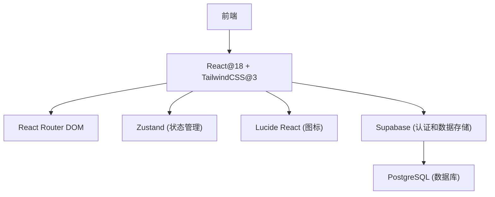
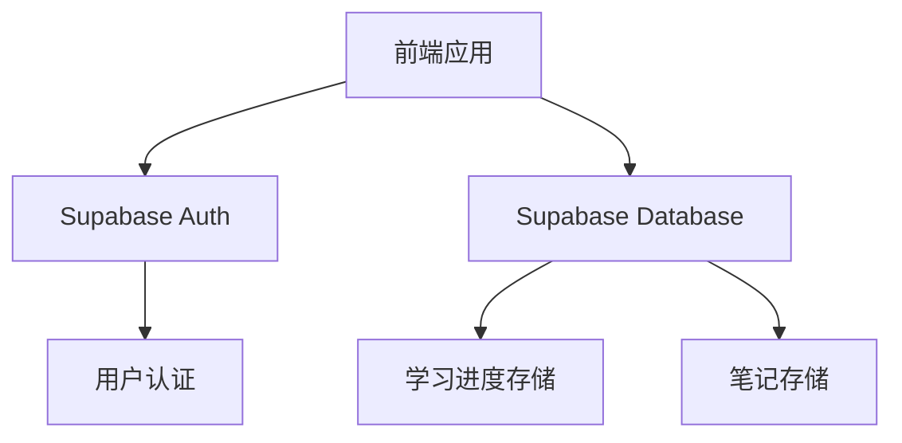
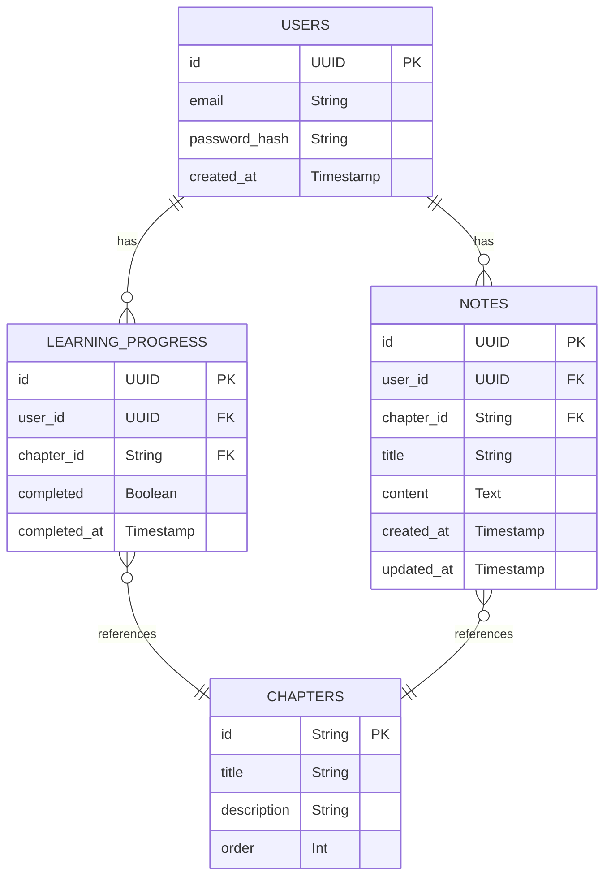

## 1. Architecture Design


## 2. Technology Description
- 前端：React@18 + tailwindcss@3 + vite
- 初始化工具：vite-init
- 后端：Supabase (用于认证和数据存储)
- 数据库：Supabase (PostgreSQL)
- 状态管理：Zustand
- 路由：React Router DOM
- 图标：Lucide React

## 3. Route Definitions
| Route | Purpose |
|-------|---------|
| / | 首页，包含导航栏、英雄区、Python课程入口等 |
| /python-course | Python基础课程学习页，包含课程目录和章节内容 |
| /python-course/:chapterId | 具体章节的学习页面 |
| /learning-records | 学习记录页，显示学习进度和笔记 |

## 4. API Definitions
### 4.1 Supabase Auth API
- 注册：`supabase.auth.signUp()`
- 登录：`supabase.auth.signInWithPassword()`
- 登出：`supabase.auth.signOut()`
- 获取当前用户：`supabase.auth.getUser()`

### 4.2 Supabase Database API
- 学习进度：
  - 获取用户学习进度：`supabase.from('learning_progress').select('*').eq('user_id', userId)`
  - 更新学习进度：`supabase.from('learning_progress').upsert({ user_id: userId, chapter_id: chapterId, completed: true })`

- 笔记：
  - 获取用户笔记：`supabase.from('notes').select('*').eq('user_id', userId)`
  - 添加笔记：`supabase.from('notes').insert({ user_id: userId, title: title, content: content, chapter_id: chapterId })`
  - 更新笔记：`supabase.from('notes').update({ content: content }).eq('id', noteId)`
  - 删除笔记：`supabase.from('notes').delete().eq('id', noteId)`

## 5. Server Architecture Diagram


## 6. Data Model
### 6.1 Data Model Definition


### 6.2 Data Definition Language
```sql
-- 创建章节表
CREATE TABLE chapters (
    id VARCHAR(255) PRIMARY KEY,
    title VARCHAR(255) NOT NULL,
    description TEXT,
    "order" INTEGER NOT NULL
);

-- 创建学习进度表
CREATE TABLE learning_progress (
    id UUID PRIMARY KEY DEFAULT gen_random_uuid(),
    user_id UUID NOT NULL REFERENCES auth.users(id),
    chapter_id VARCHAR(255) NOT NULL REFERENCES chapters(id),
    completed BOOLEAN DEFAULT false,
    completed_at TIMESTAMP WITH TIME ZONE
);

-- 创建笔记表
CREATE TABLE notes (
    id UUID PRIMARY KEY DEFAULT gen_random_uuid(),
    user_id UUID NOT NULL REFERENCES auth.users(id),
    chapter_id VARCHAR(255) REFERENCES chapters(id),
    title VARCHAR(255) NOT NULL,
    content TEXT,
    created_at TIMESTAMP WITH TIME ZONE DEFAULT NOW(),
    updated_at TIMESTAMP WITH TIME ZONE DEFAULT NOW()
);

-- 创建索引
CREATE INDEX idx_learning_progress_user_chapter ON learning_progress(user_id, chapter_id);
CREATE INDEX idx_notes_user ON notes(user_id);
CREATE INDEX idx_notes_chapter ON notes(chapter_id);

-- 插入初始章节数据
INSERT INTO chapters (id, title, description, "order") VALUES
('chapter-1', 'Python简介', 'Python的历史、特点和应用领域', 1),
('chapter-2', 'Python环境搭建', '如何安装和配置Python开发环境', 2),
('chapter-3', 'Python基础语法', '变量、数据类型、运算符等基础语法', 3),
('chapter-4', '控制流程', '条件语句和循环语句', 4),
('chapter-5', '函数', '函数定义、参数、返回值等', 5),
('chapter-6', '数据结构', '列表、元组、字典、集合等', 6),
('chapter-7', '文件操作', '文件的读写操作', 7),
('chapter-8', '异常处理', '如何处理程序运行时的异常', 8);

-- 授予权限
GRANT SELECT ON chapters TO anon, authenticated;
GRANT ALL PRIVILEGES ON learning_progress TO authenticated;
GRANT ALL PRIVILEGES ON notes TO authenticated;

-- 设置行级安全策略
ALTER TABLE learning_progress ENABLE ROW LEVEL SECURITY;
CREATE POLICY "Users can view their own progress" ON learning_progress FOR SELECT USING (user_id = auth.uid());
CREATE POLICY "Users can update their own progress" ON learning_progress FOR INSERT WITH CHECK (user_id = auth.uid());
CREATE POLICY "Users can update their own progress" ON learning_progress FOR UPDATE USING (user_id = auth.uid());

ALTER TABLE notes ENABLE ROW LEVEL SECURITY;
CREATE POLICY "Users can view their own notes" ON notes FOR SELECT USING (user_id = auth.uid());
CREATE POLICY "Users can create their own notes" ON notes FOR INSERT WITH CHECK (user_id = auth.uid());
CREATE POLICY "Users can update their own notes" ON notes FOR UPDATE USING (user_id = auth.uid());
CREATE POLICY "Users can delete their own notes" ON notes FOR DELETE USING (user_id = auth.uid());
```